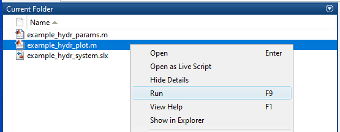

# General info
This model was created to serve as a training material for a SeAMK project called [Kasvua tuotekehityksellä Etelä-Pohjanmaan valmistavan teollisuuden pk-yrityksissä](https://projektit.seamk.fi/alykkaat-teknologiat/kasvua-tuotekehityksella-valmistavan-teollisuuden-pk-yrityksissa/) / [Growth of Manufacturing SMEs with New Product Development](https://projects.seamk.fi/en/project-database/?RepoProject=241004). The project is funded by Keski-Suomen ELY/ ESR and the schedule is 1.3.2020 - 30.6.2023.


## System description
- The purpose of the system is to open and close the safety gate. 
- Energy is fed to the system by an ideal flow source. 
- The control valve is used to define the motion direction.
- The hydraulic cylinder generates the force required to open or close the gate.

## Simulink model layout

- The control sub-model has stroke limits which are cutting off the valve control signal at a specific point. The output of a control sub-model is relative control signal -1...1.
- The pump modeling is excluded in this model and it is assumed that the supply pressure is always available without any drops. 
- The valve model consists of a valve dynamics, a flow path opening and a port flow sub-models. The output of this part is flow. 
- The hydraulic cylinder is modelled as a two separate chamber volumes and a seal friction sub-model. The force generated by the cylinder is connected to an inertial load and the motion is calculated by using the Newton's Second Law of Motion.
- The gate inertial load sub-model has a small friction component included.


## How to use the model


Copy the files (3 pcs) to yout Matlab working folder and run the plot file. The plot script loads the parameters, runs the simulation model and plots the results.


## Used Matlab and Simulink versions
```bash
>> ver
-----------------------------------------------------------------------------------------------------
MATLAB Version: 9.4.0.813654 (R2018a)
...
-----------------------------------------------------------------------------------------------------
MATLAB                                                Version 9.4         (R2018a)
Simulink                                              Version 9.1         (R2018a)
```


## Owner
- Jussi Mäkitalo
